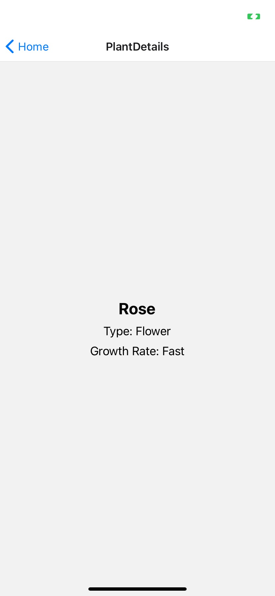

# Virtual Garden App

Day 1 screenshots: , , 

## Overview

Virtual Garden is an interactive app where users can plant, grow, and manage a virtual garden with various plants and flowers. With premium content, users can enjoy an enhanced experience, including AR integration, weather simulations, and community features.

## Features

- **GardenView:** Explore your garden with animations and AR integration.
- **PlantCard:** Display detailed information about each plant and interact with care options.
- **WeatherWidget:** Simulate and display real-time weather conditions in your garden.
- **SubscriptionScreen:** Manage your premium subscription for exclusive features.
- **CommunityGarden:** Connect with others, share your garden, and participate in community events.

## Premium Features

- Access to rare and exclusive plants.
- Advanced garden management tools.
- Augmented Reality (AR) experience.
- Participation in community events and garden sharing.

## Installation

1. Clone the repository:
   ```bash
   git clone https://github.com/qilinxie02/VirtualGarden.git
